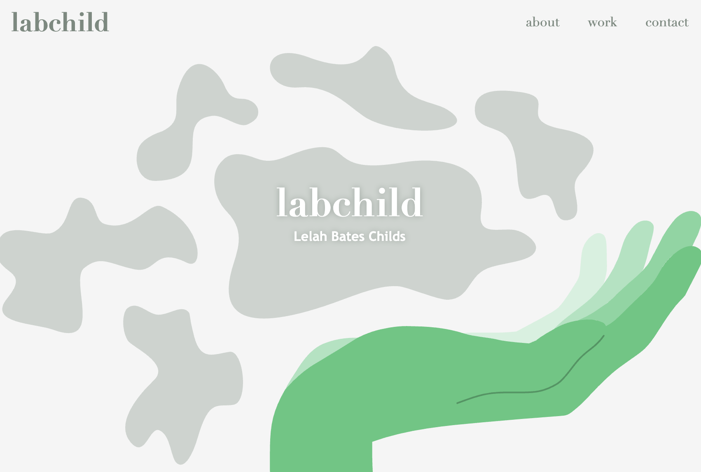

# labchild's Portfolio
A website to showcase my work.

## Description
A central webpage to host links to all of my deployed projects. Also includes a brief bio and ways to contact me.

### Key Features
* Working links to other parts of the page and other parts of the web.
* Code is commented to provide clarity.
* Responsive and modern web layout using advanced CSS.

## Built With
* HTML
* CSS

## Download and View
This portfolio can be found at https://labchild.github.io/portfolio/.
You can download the repo and check out my codebase at https://github.com/labchild/portfolio.

## Author & Acknowledgments 
Refactored and deployed by Lelah Bates Childs.

Thank you to my bootcamp instructional team and cohort, for helping me along this journey to become a developer.

### Want to Help? 
Do you see something I missed or a more succint and effective way this code can be written? Great! Please reach out and let me know how I can improve.

You can find me on GitHub (@labchild) or email me (labchilds@gmail.com). Thanks in advance for your tips, tricks, and pointers!